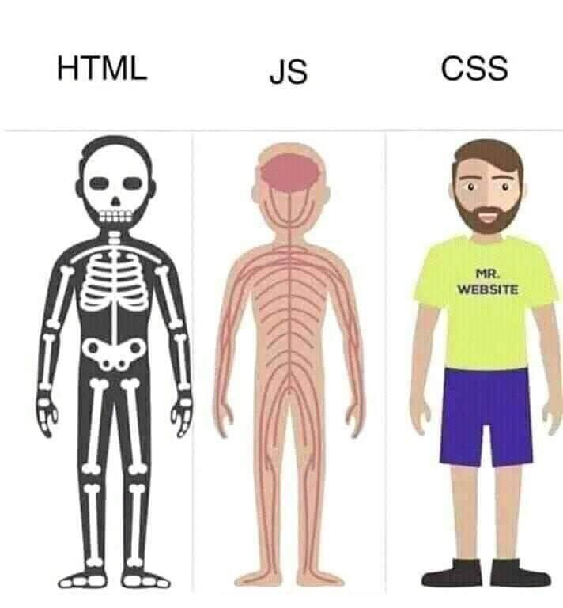

# Tu página personal #

## Introducción ##

Este será tu primer proyecto donde crearás tu página personal con tecnologías HTML y CSS y diseño web "mobile first"



## Requisitos ##

- HTML5
- CSS3
- Mobile first. Adaptado a móvil, tablet y laptop
- Javascript

El sitio web constará de varias secciones que deberán ser construidas en distintos ficheros `html`. 

Cada sección deberá contener un bloque de navegación que permita al usuario moverse entre páginas. 

El proyecto deberá tener _como mínimo_ las siguientes secciones:

- Home o página de bienvenida

- Biografía

- Portfolio 

- Contacto


## Iteraciones ##

### HTML5 ###

1. **`Home o página de bienvenida`**

    Esta será la página `index.html` y por lo tanto la que se verá primero.

    Contendrá el bloque de navegación para poder dirigirnos al resto de las secciones.

2. **`Biografía`**

    Nueva página de nombre `biografia.html`.
    Su contenido estará conformado por texto y como mínimo una imagen. 

3. **`Portfolio`**

    Nueva página, de nombre `portfolio.html`, en la que se deberán incluir como mínimo algunos elementos multimedia (imágenes, videos, audios).

4. **`Contacto`**

    Nueva página, de nombre `contacto.html`, en la que se deberá incluir al menos un formulario.

5. **`Etiquetas semánticas HTML5`**

    En este paso habrás de hacer una revisión de los ficheros html creados y agregar todas las etiquetas semánticas posibles.

### CSS3 ###

1. Tipografía personalizada

    El proyecto deberá tener al menos una tipografía personalizada que no tengan por defecto los navegadores.

    Sigue las instrucciones en [W3Schools](https://www.w3schools.com/howto/howto_google_fonts.asp) para añadirla
    Puedes utilizar [Google Fonts](https://fonts.google.com) para encontrar una tipografía adecuada.

2. Selectores

    Haz un uso adecuado de selectores CSS: `element, id, class, selectores compuestos, etc...`

3. Modelo de cajas CSS

    Recuerda trabajar con `margin, padding, border` en los estilos de según lo veas conveniente.

4. Efectos

    Utiliza pseudoclases: `Hover,focus, etc...` para dar un poco de dinamismo a la página.

    Puedes utilizar las propiedades `display o visibility` en combinándolas con las pseudoclases.


5. Distribuciones de la página

    Distribuye todos los bloques que haya en tu página con flex.

6. "Mobile first!"

    Has de hacer que tu página pueda verse correctamente en móvil, tablet y escritorio. Utiliza todo lo visto sobre diseño fluido, flexbox, media queries para lograrlo.

### JavaScript ###

1. Requisitos

    - Manipulación dinámica del DOM
    - Sin frameworks ni librerias externas
    - Código limpio, buenas prácticas

2. Hacer uso de javascript básico

    - Variables, operadores, condicionales
    - Funciones
    - Bucles
    - Manejo de objetos array, string
    - BOM y DOM: Manejo de eventos
    - Validación de formularios

3. **Ejercicios JS**

    - Validar por JS el formulario creado en `contacto.html`
    - Dado el array de objetos portfolio, pintar en el DOM de `portfolio.html` tarjetas con detalles de cada trabajo del porfolio utilizando JS. 
    
    Ejemplo del array porfolio de Pablo Picasso:

```javascript
    const porfolio = [
  {
    "title": "Guernica",
    "year": 1937
    "location": "France",
    "imageLink": "images/guernica.jpg",
  },
    {
    "title": "Las señoritas de Avignon",
    "year": 1907
    "location": "Museo de Arte Moderno, Nueva York",
    "imageLink": "images/senoritas_avignon.jpg",
  },
    {
    "title": "La mujer que llora",
    "year": 1937
    "location": "Tate Modern, en Londres",
    "imageLink": "images/la_mujer_que_llora.jpg",
  }
  
```
Otros ejemplos de Javascript para introducir en nuestra web:
- Menú hamburguesa para vista móvil
- Mensaje de alerta al hacer click en botón
- Mostrar/esconder info cuando pasamos el ratón sobre un elemento HTML
- Animación de carga (spinner)

### Sube a GitHub tu proyecto! 🚀 ###
🧩 [Guia Git y GitHub](git-y-github.md)

1. Crear un repositorio en Github para la página de tu biografía.

    1.1 Crear un repositorio para el nuevo proyecto

    1.2 Una vez hecho esto, crea la página de tu biografía o presentación. Llámala `biografia.html` Aplica todo lo aprendido sobre marcado de texto y formato.

    1.3 Sube tu proyecto a Github.

    1.4 Se valorará el uso de ramas en GIT: `main`, `develop`, `feature_branch`.
    
    1.4 Desplegar la app en **GitHub pages**. Una vez en tu repositorio (en el navegador) ve a **Settings -> Github Pages** y en **Source** cambia la opción de **none** a **main** 
    - [Tutorial Github pages](https://docs.github.com/en/pages/getting-started-with-github-pages/creating-a-github-pages-site#creating-your-site)

🧩 [Aquí encontrarás una lista de links a recursos que podrían servirte](./recursos-ejercicio.md)


### Y lo más importante. Diviértete y tira de imaginación ###

Cualquier otro extra que se te ocurra será bienvenido :blush: ¡A por ello!


